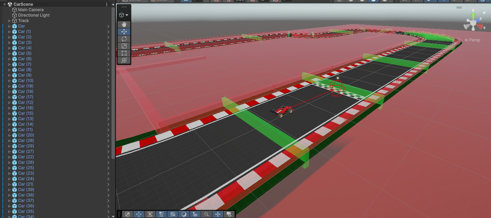

# AI Learns to Drive!

Unity ML-Agents ve PPO (Proximal Policy Optimization) algoritmasını kullanarak, yapay zekanın bir yarış arabasını kontrol etmesini öğretmek amacıyla bu proje yapılmıştır.

## Kullanılan Teknolojiler

**Game Engine:** Unity 6.4

**Framework:** Unity ML-Agents

**Language:** C# (Unity)

## Yapılacaklar Listesi

- ✅ - Pist Düzenlenmesi
- ✅ - Araba Kontrolleri
- ✅ - Test Kamerası
- ✅ - Basit AI Eğitilmesi
- ❔ - Rastgele Pist Oluşturulması
- ❔ - Oyuncuyu Algılayabilen AI Eğitilmesi
- ❔ - Farklı yükseklikleri olan Pist Oluşturulması
- ❔ - Performans Detaylarının UI'da Gösterilmesi
- ve daha fazlası...

## Agent Mimarisi

- **Space Size: 7** (Agent, çevresini 7 farklı değer üzerinden algılar.)
    - **Direction to Next Checkpoint: x,y,z** (Sonraki Checkpoint'e giden vektör)
    - **Forward Vector: x,y,z** (Aracın kendi yönü)
    - **Linear Velocity Magnitude: 1** (Aracın kendi hızı)
- **Actions (Discrete Branches)** (Agent'in output ettiği değerler)
    - **Branch 0 (Vertical):** [0, İleri, Geri]
    - **Branch 1 (Horizontal):** [0, Sağ, Sol]
    - **Branch 2 (Braking):** [0, Fren]

    

## Demo

## Screenshots

